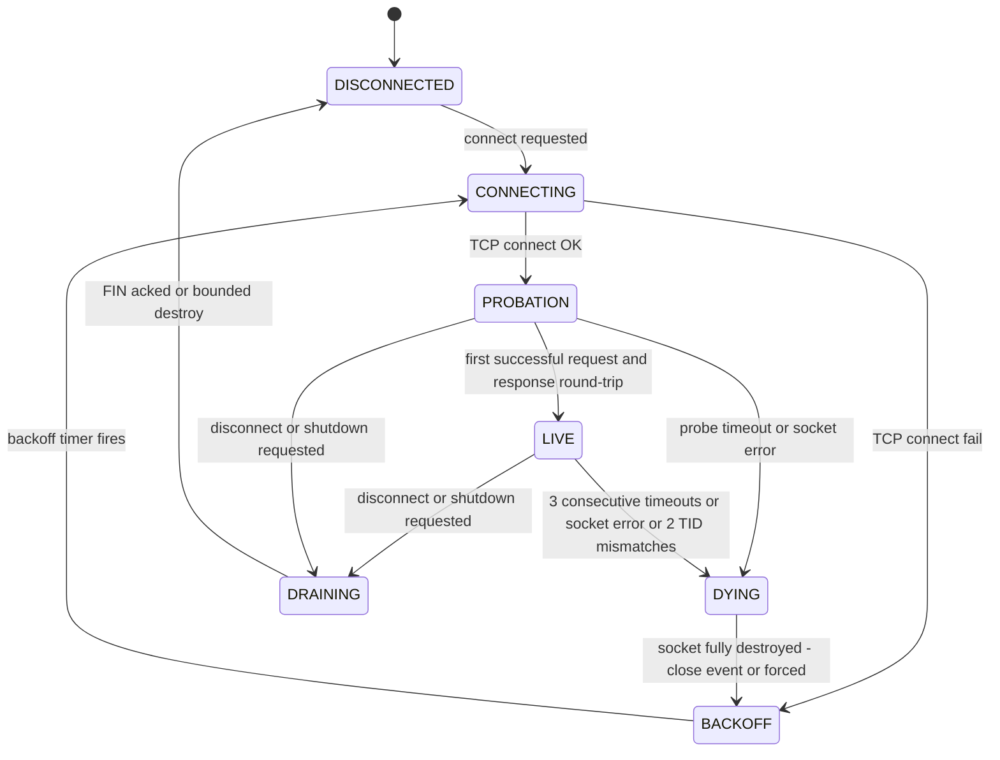

# Modbus TCP Client Hardening Plan

**Goal:** The host must never abandon a socket without FIN, must detect dead connections and reconnect with discipline, and must never let a write be the first frame on an unproven connection. Designed against the packet-capture facts from the field failure (device held hostage by our vanished connection; reconnects ACKed but never answered; retries into the void; multiple pinned connections starving the device's IP stack).

**Constraints honored:** modbus-serial stays as transport (wrapped, not forked). Polling cadence (~500 ms) and register map unchanged. All changes in main process: [`src/modbus-manager.js`](../src/modbus-manager.js), [`src/jerry-device.js`](../src/jerry-device.js), [`src/main.js`](../src/main.js), plus one new file `src/tid-guard.js` and a small renderer health panel.

---

## 0. Root-cause explanations found in code (answers the capture questions)

### 0.1 Why the first frame on reconnect is `Write Multiple Registers, Unit 1, TID 1`

- [`main.js:76-105`](../src/main.js:76): `modbusManager.on('connected', …)` writes SNTP config `client.writeRegisters(305, [reg1, reg2])` + `writeCoil(31, true)` — **FC16 Write Multiple Registers**.
- This handler **never calls `client.setID(unitId)`** → modbus-serial's default unit ID is **1**. Polling sets `setID(dev.id)` (e.g. 2), which is why normal traffic is Unit 2 but this write is Unit 1.
- **TID 1**: every new `TcpPort` starts `_transactionIdWrite = 1` ([`tcpport.js:36`](../node_modules/modbus-serial/ports/tcpport.js:36)). Fresh socket ⇒ TID restarts at 1. (Cosmetic; acceptable, but we'll log it.)
- The auto-reconnect timer path ([`modbus-manager.js:167-224`](../src/modbus-manager.js:167)) runs in the **base class** and never goes through `JerryDevice.connect()` — so on reconnect there is **no version-check read**; the `'connected'` event fires and the SNTP write is the literal first frame on the wire. **This is the misdirected write from the capture. Not a stale queue replay — a config write raced onto an unproven socket with a default unit ID.**

### 0.2 Why we retried into the void

- Response timeout in modbus-serial deliberately does **not** close the socket ([`tcpport.js:163-169`](../node_modules/modbus-serial/ports/tcpport.js:163)). Our `_drain` catches the rejection and just moves to the next queued op. Nothing counts consecutive timeouts; nothing ever declares the connection dead. The polling loop keeps enqueueing every 500 ms forever.

### 0.3 Why sockets vanish without FIN

- No `before-quit` / signal / `powerMonitor` handlers exist. [`main.js:415-419`](../src/main.js:415) only stops polling and closes the DB on `window-all-closed` — sockets are left to die with the process.

---

## 1. Connection state machine (core design)

Replace the boolean `isConnected` with an explicit per-connection state, kept on `connectionObj.state`:

Key rules:

1. **PROBATION** — TCP connect succeeded but the device has proven nothing (the capture shows the device ACKs while dead). Only **reads** may run; all writes queued during PROBATION wait. The probe is the existing version read (`readInputRegisters(100, 3)` in [`jerry-device.js:29`](../src/jerry-device.js:29)), now used on **every** connect including auto-reconnect.
2. **LIVE** — entered only after a completed request/response round-trip. Only here: backoff resets to base, `'live'` event emitted (replaces the current use of `'connected'` for config writes), writes allowed.
3. **DYING → BACKOFF** — the old socket must be **fully destroyed** (`close` event received, or `destroy()` forced after a 1 s bound) before the state may leave DYING. A new `connectTCP` can only ever start from BACKOFF/DISCONNECTED. This structurally enforces **exactly one socket per device** (fixes issue 02).
4. **Backoff ladder:** 1 s → 2 s → 5 s → 10 s (cap), ±20 % jitter. Reset to 1 s **only on entering LIVE**, never on TCP connect success. `initDevices`/refresh no longer resets `retryCount` blindly ([`modbus-manager.js:44`](../src/modbus-manager.js:44) removed); a manual refresh just short-circuits the pending BACKOFF timer to fire now (once).

---

## 2. Work breakdown

### P0 — Never abandon a socket without FIN

**P0-1: `ModbusManager.shutdownAll(reason)`** (new method, `modbus-manager.js`)
- For every tracked connection: set `aborted`, cancel reconnect timer, reject queued ops, call `client.close()` (FIN via `socket.end()`), race the socket `close` event against a **1.5 s** timeout, then `destroy()` any survivor.
- Returns a promise; idempotent (re-entry guard) so multiple exit paths can call it safely.

**P0-2: Wire every exit path** (`main.js`)
- `app.on('before-quit')`: `event.preventDefault()` once → `stopPollingLoop()` → `await shutdownAll('quit')` (bounded ≤ 2 s) → `app.exit(0)`. A `isShuttingDown` flag prevents recursion.
- `window-all-closed`: same routine before `app.quit()`.
- `process.on('SIGINT')` / `process.on('SIGTERM')`: same routine.
- `mainWindow.webContents.on('render-process-gone')`: log + shutdownAll + relaunch window (sockets must not linger while the UI is dead).

**P0-3: Sleep/resume** (`main.js`)
- `powerMonitor.on('suspend')`: `stopPollingLoop()` → `await shutdownAll('suspend')`. Devices see clean FINs before the host vanishes.
- `powerMonitor.on('resume')`: if network was enabled, wait 2 s (NIC settle), re-run `initDevices(await db.getDevices())`, restart polling loop.

### P1 — Dead-connection detection & disciplined reconnect

**P1-4: Application-level liveness** (`modbus-manager.js` `_drain`)
- Track `consecutiveTimeouts` per connection. Any successful op → reset to 0 and stamp `lastResponseAt`. On the **3rd** consecutive timeout: log `DECLARED-DEAD`, transition LIVE→DYING, `client.destroy()` (RST acceptable here per spec), enter BACKOFF. All still-queued ops rejected with `ConnectionDeclaredDead`.

**P1-5: Strict single-socket enforcement** (fixes [issue 02](issues/02-zombie-socket-leak-reconnect.md))
- Reconnect procedure: (a) destroy old client and **await its `close` event** (bounded 1 s) before constructing the new `ModbusRTU`; (b) re-check `connectionObj.aborted` after **every** `await` (post-destroy-wait, post-`connectTCP`, post-probe) — on abort, destroy whatever socket exists and stop; (c) `disconnect()` and `connect()` always `clearTimeout(reconnectTimer)` first.
- A `generation` counter on connectionObj: each reconnect increments it; stale timer callbacks compare their captured generation and bail if outdated. This kills the remaining zombie window deterministically.

**P1-6: Exponential backoff** — ladder as in §1; `retryCount` becomes `backoffIndex`; reset only on LIVE.

**P1-7: TCP keepalive** — after `connectTCP` resolves, reach the raw socket (`client._port._client`) and `setKeepAlive(true, 15000)`. Wrapped in try/catch with a version-drift warning if the internal path changes.

### P2 — Protocol hygiene

**P2-8a: TID validation — new `src/tid-guard.js`**
- modbus-serial reads the response TID into `_transactionIdRead` ([`tcpport.js:126`](../node_modules/modbus-serial/ports/tcpport.js:126)) and its `index.js` *does* check `transactionIdRead === _port._transactionIdWrite` — **verify this in 8.0.25's `index.js` first** (todo step). Whatever it silently drops, we still need loud logging and the 2-strike rule. Implementation: after `connectTCP`, wrap the port's `data` emission (monkey-patch `client._port.emit` or subscribe alongside) to compare `_transactionIdRead` vs last-written TID; on mismatch → `log.error('[TID-MISMATCH] …')`, increment `tidMismatches`; at 2 → force LIVE→DYING→BACKOFF reconnect. Counter resets on clean round-trip.
- If verification shows index.js already discards mismatched TIDs silently, our guard's job is only detection + reconnect policy — no frame re-injection needed.

**P2-8b: Reconnect write ordering + Unit 1 fix** (`jerry-device.js`, `main.js`, `modbus-manager.js`)
- Route the auto-reconnect path through the same probe as first connect: extract the version-check into `JerryDevice._probe(ip, port)`; base-class reconnect success now calls an overridable `onReconnected()` hook that runs the probe. LIVE is only entered after the probe read succeeds.
- Split events: `'connected'` (TCP only, internal) vs **new `'live'`** (probe passed). Move the SNTP/config writes in [`main.js:76-105`](../src/main.js:76) to `'live'`.
- Add the missing `client.setID(dev.id)` inside those config writes — **eliminates the Unit 1 misdirected write**.
- Result: first frame on every fresh connection is always the probe **read**; no write before a successful read proves the connection sane.

**P2-9: MISMATCH re-enforcement restructure** (`main.js` polling tick)
- Today: `enqueueHighPriority(...)` fired (un-awaited) from *inside* the readCoils op callback → write handed to the socket while the read is mid-flight (pipelining the device can't handle).
- New shape: during the read op, only **collect** `pendingCorrections[]`. After the read's `enqueue(...)` promise resolves, loop the corrections and `await modbusManager.enqueueHighPriority(...)` for each, sequentially. All traffic strictly serialized through the per-device queue; failure counting (`consecutiveFails`/FAULT) logic preserved unchanged.

### P3 — Observability

**P3-10:** Rewrite the `unhandledRejection` filter ([`main.js:53-64`](../src/main.js:53)): matching errors are logged at `warn` with message + stack instead of silently returned. Rate-limit (max 1/sec/message-type) to avoid log floods during an outage.

**P3-11:** `logTransition(key, from, to, detail)` helper in `modbus-manager.js` — every state-machine edge logs one line: ISO timestamp, `ip:port`, `FROM→TO`, detail (e.g. `timeout 3/3`, `probe ok in 12 ms`, `backoff 5000ms`). Goes through electron-log → persistent file (already 100 MB rotating) + syslog in factory mode.

**P3-12:** Extend `getConnectionStatuses()` with `state`, `lastResponseAt` (age computed client-side), `consecutiveTimeouts`, `reconnectCount`, `tidMismatches`. Renderer's existing `onNetworkUpdate` status strip gains these fields (compact: `Unit 2 — LIVE — last resp 0.4s — rc 3`). No new IPC channel needed; payload extension only.

---

## 3. Test plan

### Automated (extend [`tests/modbus-simulator.js`](../tests/modbus-simulator.js))

New simulator modes:
1. **accept-but-never-respond** — completes TCP handshake, ACKs data, sends nothing (the capture scenario).
2. **wrong-TID** — responds with TID+1.
3. **drop-mid-poll** — hard-closes after N responses.
4. **single-connection** — mirrors device: serves one socket, queues the rest.

Regression tests (jest, main-process units):
- 3 consecutive timeouts → socket destroyed, state DYING→BACKOFF, queued ops rejected (P1-4).
- Backoff sequence 1/2/5/10/10 s observed; reset only after simulated round-trip (P1-6).
- During 50 forced reconnect cycles against drop-mid-poll: never >1 socket per device (assert via tracked socket set) (P1-5).
- wrong-TID mode: 2 mismatches → reconnect; mismatch counter logged (P2-8a).
- First frame after every (re)connect is `readInputRegisters(100,3)`, correct unit ID; no FC16 before probe (P2-8b — assert on simulator's received-frame log).
- shutdownAll: all sim connections receive FIN within 2 s (P0-1).

### Bench acceptance (manual, real device — from the task spec)

- **A. Hard kill:** task-manager kill mid-poll → relaunch → device answers within 30 s.
- **B. Firewall drop 2 min:** app backs off (1→2→5→10 s), **netstat/Wireshark shows ≤1 socket** to the device, polling resumes on restore.
- **C. Sleep 5 min → wake:** clean re-establishment; capture shows every host connection ends in FIN or deliberate RST.
- **D. 24 h soak** with hourly forced disconnects: zero zombie sockets, `TID-MISMATCH` count 0, stable memory.

---

## 4. File-by-file change summary

| File | Changes |
|---|---|
| `src/modbus-manager.js` | State machine, backoff ladder, liveness counter in `_drain`, single-socket reconnect procedure with generation counter, `shutdownAll()`, keepalive, `logTransition`, extended statuses, `'live'` event |
| `src/jerry-device.js` | Version check refactored into `_probe()`; used on every connect *and* reconnect via hook; removes map re-insertion hack (state machine covers UI error display) |
| `src/main.js` | Exit-path handlers (before-quit, signals, render-gone), powerMonitor suspend/resume, config writes moved to `'live'` + `setID` fix, MISMATCH correction restructure, unhandledRejection logging |
| `src/tid-guard.js` (new) | TID validation wrapper + 2-strike reconnect policy |
| `src/preload.js` / `src/renderer/renderer.js` | Health fields in status strip (payload extension of existing `network-update`) |
| `tests/modbus-simulator.js` + new test files | Simulator failure modes + regression tests listed above |

**Sequencing:** P0 (safe, independent) → P1-5/P1-6 (state machine core) → P1-4/P1-7 → P2-8b → P2-9 → P2-8a (needs library verification first) → P3 (any time after state machine lands).

**Risk notes:**
- `client._port._client` (keepalive, TID guard) is internal API of modbus-serial 8.0.25 — pin the dependency version and add a startup assertion that the path exists.
- The `'connected'`→`'live'` event split changes when SNTP/config writes fire; devices that were relying on getting config *before* first poll still get it before writes are allowed to anything else (probe → live → config writes are first in the write queue).
